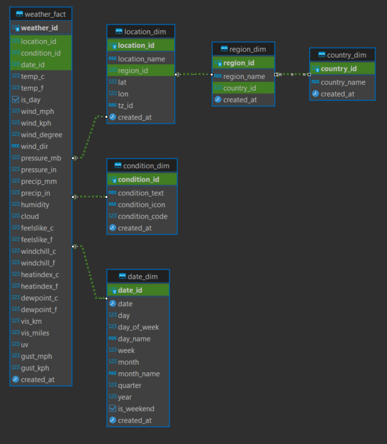
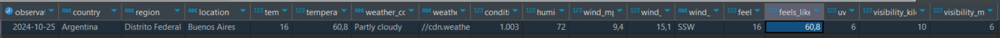

# Pipeline de Carga de Datos Meteorológicos con Airflow y Docker

Este proyecto implementa un **pipeline ETL** (Extracción, Transformación y Carga) orquestado con **Apache Airflow** para procesar y cargar datos meteorológicos en un modelo dimensional alojado en **Amazon Redshift**. El proyecto se encuentra dockerizado con la idea de que éste sea reproducible.


## 1. Descripción General
El pipeline ingesta datos meteorológicos de una API (WeatherAPI) para varias ubicaciones, transformando y cargando esta información en un esquema dimensional en Amazon Redshift. Los datos incluyen detalles sobre la condición climática, temperatura, humedad y otros indicadores relevantes. Airflow se utiliza para orquestar este proceso de ingesta y carga en intervalos regulares.


## 2. Herramientas Principales Utilizadas
- **Python 3.10**: Para la escritura de los scripts ETL.
- **Apache Airflow**: Orquestación del pipeline, ejecutado en Docker.
- **Docker**: Para contenerizar todo el flujo de trabajo y garantizar su portabilidad.
- **Amazon Redshift**: Almacenamiento y modelado de los datos en un esquema dimensional.
- **WeatherAPI**: Fuente de datos meteorológicos.
- **GitHub Actions**: Implementación de CI para la ejecución automática de tests.


## 3. Arquitectura del Pipeline
El pipeline ETL sigue estos pasos:
1. **Extracción**: Se obtienen datos meteorológicos de varias ubicaciones mediante la API de WeatherAPI y se ingestan en una tabla de staging llamada **weather_staging**.
2. **Transformación**: Los datos se procesan y transforman en un formato adecuado para cargar en un modelo dimensional.
3. **Carga**: Los datos procesados se insertan en un esquema de tablas de Redshift que incluye las dimensiones **country**, **region**, **location**, **condition** y **date** y una tabla de hechos **weather**.


## 4. Despliegue de Airflow con Docker
El despliegue de Airflow está dockerizado utilizando la imagen oficial de Apache Airflow. Las configuracion y DAG de Airflow se incluyen en el repositorio el cual se orquestó en intervalos regulares de 4 horas para ingestar y cargar los datos.


## 5. CI/CD con GitHub Actions
Se implementó un pipeline de **Integración Continua (CI)** en GitHub Actions que:
- Ejecuta tests unitarios cada vez que se hace un `push` o `pull_request` al repositorio.
- Verifica que el código siga los estándares de calidad PEP8.
- Además ejecuta otro test que incluye llamadas a la API de WeatherAPI, asegurándose de que los tipos de datos sean los configurados en el modelo dimensional.


## 6. Scripts

### Directorio `scripts/`

En el directorio `scripts/` se encuentran los archivos principales que gestionan la lógica de extracción, transformación y carga de datos como así también la creación del modelo
dimensional. Dentro de `scripts`, existe un subdirectorio `model_scripts/` que contiene scripts de creación específicos para cada tabla en el modelo. Los scripts son:

- **Directorio `model_scripts/`**: Aquí se encuentran los scripts de creación de cada tabla dentro del modelo dimensional de Redshift. Ejemplos de scripts dentro de este directorio son:
  - `country_dim_creation.py`: Crea la tabla `country_dim`.
  - `region_dim_creation.py`: Crea la tabla `region_dim`.
  - `location_dim_creation.py`: Crea la tabla `location_dim`.
  - `condition_dim_creation.py`: Crea la tabla `condition_dim`.
  - `weather_fact_creation.py`: Crea la tabla `weather_fact`.
  - `weather_staging_creation.py`: Crea la tabla de staging `weather_staging`.
- **`ingest.py`**: Este script realiza el proceso de ingesta de datos meteorológicos en Amazon Redshift. Primero, establece una conexión a Redshift utilizando las credenciales almacenadas en un archivo `.env` y carga las variables necesarias como el `API_HOST` y `API_KEY`. La función `extract_weather_data()` realiza la extracción de datos desde la API de WeatherAPI para una lista de ubicaciones y retorna un conjunto de datos relevantes como temperatura, humedad, condiciones del viento y más. Posteriormente, la función `load_weather_data_to_redshift()` inserta los datos extraídos en la tabla de staging `weather_staging` en Redshift. El script principal recorre varias ubicaciones, ejecutando todo el proceso de extracción y carga para cada una, procesando y almacenando los datos meteorológicos en la base de datos.
- **`country_dim_load.py`**: Este script extrae los países únicos desde la tabla de staging `weather_staging` en Redshift y los inserta en la tabla `country_dim`. Primero, establece una conexión a Redshift usando las credenciales definidas en un archivo `.env`. La función `get_countries_from_staging()` consulta los países registrados en los últimos 30 minutos desde `weather_staging`. Luego, la función `insert_countries_into_country_dim()` inserta esos países en la tabla `country_dim`, evitando duplicados mediante una verificación previa. Finalmente, el script principal ejecuta el proceso y, si no hay países nuevos, muestra un mensaje indicándolo. Después de la ejecución, se cierra la conexión a la base de datos.
- **`region_dim_load.py`**: Este script extrae las regiones y países únicos desde la tabla de staging `weather_staging` en Redshift y los inserta en la tabla `region_dim`. Primero, establece una conexión a Redshift utilizando las credenciales almacenadas en un archivo `.env`. La función `get_regions_from_staging()` consulta las regiones y países registrados en los últimos 30 minutos. Luego, la función `insert_regions_into_region_dim()` inserta las regiones en la tabla `region_dim`, asegurándose de que el país correspondiente ya exista en la tabla `country_dim`. Si la región ya existe, no se duplica; de lo contrario, se inserta junto con la referencia al país correspondiente. Finalmente, el script cierra la conexión después de ejecutar el proceso.
- **`location_dim_load.py`**: Este script extrae ubicaciones únicas desde la tabla de staging `weather_staging` en Redshift y las inserta en la tabla `location_dim`. Primero, se establece una conexión con Redshift utilizando las credenciales almacenadas en un archivo `.env`. La función `get_locations_from_staging()` consulta las ubicaciones registradas en los últimos 30 minutos, extrayendo detalles como el nombre de la ubicación, la región, la latitud, la longitud y el identificador de zona horaria. La función `insert_locations_into_location_dim()` inserta estas ubicaciones en la tabla `location_dim`, asegurándose de que la región correspondiente ya exista en la tabla `region_dim`. Si la ubicación ya existe, se omite; de lo contrario, se inserta junto con la referencia a la región. El script cierra la conexión tras completar el proceso.
- **`condition_dim_load.py`**: Este script extrae las condiciones climáticas únicas desde la tabla de staging `weather_staging` en Redshift y las inserta en la tabla `condition_dim`. Primero, se establece una conexión con Redshift utilizando las credenciales almacenadas en un archivo `.env`. La función `get_conditions_from_staging()` consulta las condiciones climáticas registradas en los últimos 30 minutos, extrayendo detalles como el texto descriptivo de la condición, el ícono y el código de la condición. La función `insert_conditions_into_condition_dim()` inserta estas condiciones en la tabla `condition_dim`, asegurándose de que no existan duplicados basados en el código de la condición. Si la condición ya existe, se omite; de lo contrario, se inserta. El proceso finaliza cerrando la conexión a la base de datos.
- **`weather_fact_load.py`**: Este script carga los datos meteorológicos desde la tabla `weather_staging` a la tabla `weather_fact` en Redshift. Primero, se establece una conexión con la base de datos utilizando las credenciales almacenadas en un archivo `.env`. La función `load_weather_data()` selecciona los registros insertados en los últimos 30 minutos desde `weather_staging`, y luego, para cada registro, busca el `date_id` desde la tabla `date_dim`, el `location_id` desde `location_dim` y el `condition_id` desde `condition_dim`. Si todos estos identificadores están presentes, el registro se inserta en la tabla `weather_fact`. Si alguno falta, el registro es omitido. Finalmente, el proceso guarda los cambios y cierra la conexión con la base de datos.

### Directorio `dags/`

En el directorio `dags/` se encuentra el archivo que configura la orquestación que ejecutará Airflow. El script es:

- **`create_redshift_model_dag.py`**: Este DAG permite crear el modelo dimensional en Redshift. Contiene tareas para ejecutar cada script de creación de tabla desde `model_scripts/` y la carga de datos en `date_dim`. Este DAG se ejecuta únicamente de forma manual desde la interfaz de Airflow, permitiendo crear el modelo solo cuando sea necesario.
- **`weather_etl_dag.py`**: Este DAG de **Airflow** llamado `etl_dag` está diseñado para orquestar el proceso ETL (Extracción, Transformación y Carga) en **Redshift**. Se ejecuta cada 4 horas y utiliza operadores de Python para ejecutar scripts que realizan diferentes tareas de carga de datos.
    - La función `run_script()` se encarga de ejecutar scripts Python específicos, ubicados en el directorio `/opt/airflow/scripts/`.
    - El DAG está compuesto por varias tareas (`PythonOperator`), cada una de las cuales ejecuta un script. Por ejemplo, `ingest_data` ejecuta `ingest.py` para extraer los datos desde la API, y los operadores como `load_country_dim`, `load_region_dim`, etc., se encargan de cargar las diferentes dimensiones (`country_dim`, `region_dim`, `location_dim`, `condition_dim`) y la tabla de hechos `weather_fact`.
    - El flujo de las tareas está organizado en un orden lógico: primero se ejecuta `ingest_data`, y luego las cargas de las dimensiones y la tabla de hechos, asegurando que los datos estén correctamente estructurados antes de ser insertados en la tabla `weather_fact`.
Este DAG garantiza que el proceso ETL se ejecute de manera automatizada y en el orden correcto según las dependencias del modelo dimensional.

### Directorio `tests/`

En el directorio `tests/` se encuentran los archivos que ejecutaran los tests de la Integración Continua. Los scripts son:

- **`test_ingest.py`**: Este script implementa un **test de validación de la API de WeatherAPI** que verifica que los datos meteorológicos obtenidos para una lista de ubicaciones se ajusten a la estructura y tipos de datos esperados según la tabla en **Redshift**.
    - Se cargan las credenciales de la API desde un archivo `.env` y se define una lista de ubicaciones para realizar las solicitudes.
    - El test `test_api_fetch_for_all_locations()` realiza una solicitud HTTP para cada ubicación, verifica que la API responda con éxito (código de estado 200) y extrae los datos relevantes.
    - La estructura de los datos obtenidos (nombre de la ubicación, temperatura, condiciones del viento, etc.) se compara con una estructura de tipos de datos predefinida que coincide con la tabla en Redshift.
    - Si los tipos de datos coinciden, se valida que los datos son correctos; de lo contrario, se lanza una excepción indicando el tipo de error.
Este test asegura que los datos recibidos desde la API sean compatibles con el esquema de la base de datos, ayudando a prevenir problemas de carga.
- **`test_pep8.py`**: Este script implementa un **test de conformidad con PEP8** utilizando la herramienta **flake8**. La función `test_pep8_conformance()` ejecuta un comando que verifica que todo el código en el repositorio cumpla con las reglas de estilo PEP8, con una longitud máxima de línea de 88 caracteres. Algunos directorios como `pdap`, `pdap_test` y `drafts` están excluidos de la verificación. Si el código no cumple con las reglas, el test falla y se imprime una lista de errores de estilo. Este test es esencial para mantener una calidad de código consistente en el proyecto.


## 7. Uso de Variables Sensibles
Se gestionan claves y URL de la API mediante **GitHub Secrets**, asegurando que las variables sensibles, como `API_HOST` y `API_KEY`, se mantengan seguras y no se expongan en el código y puedan ser utilizadas en los tests.

## 8. Modelado dimensional



En este gráfico podemos apreciar las tablas y sus relaciones del modelo. Se buscó normalizar lo mas posible a efectos de ejercitar este concepto, no obstante se podría haber evitado
la dimensión country. Presentamos una query de ejemplo:
```SQL
SELECT
    d.date AS observation_date,
    c.country_name AS country,
    r.region_name AS region,
    l.location_name AS location,
    w.temp_c AS temperature_celsius,
    w.temp_f AS temperature_fahrenheit,
    cond.condition_text AS weather_condition,
    cond.condition_icon AS weather_icon_url,
    cond.condition_code AS condition_code,
    w.humidity,
    w.wind_mph,
    w.wind_kph,
    w.wind_dir,
    w.feelslike_c AS feels_like_celsius,
    w.feelslike_f AS feels_like_fahrenheit,
    w.uv,
    w.vis_km AS visibility_kilometers,
    w.vis_miles AS visibility_miles
FROM
    "2024_gabriel_medardo_gudino_schema".weather_fact w
JOIN
    "2024_gabriel_medardo_gudino_schema".date_dim d ON w.date_id = d.date_id
JOIN
    "2024_gabriel_medardo_gudino_schema".location_dim l ON w.location_id = l.location_id
JOIN
    "2024_gabriel_medardo_gudino_schema".region_dim r ON l.region_id = r.region_id
JOIN
    "2024_gabriel_medardo_gudino_schema".country_dim c ON r.country_id = c.country_id
JOIN
    "2024_gabriel_medardo_gudino_schema".condition_dim cond ON w.condition_id = cond.condition_id
WHERE
    d.year = 2024
    AND d."day" = 25
    AND d."month" = 10    
    AND c.country_name = 'Argentina'
    AND l.location_name = 'Buenos Aires'
ORDER BY
    d.date DESC;
```
Cuya salida fue:



## 9. Instrucciones para Ejecutar el Proyecto
Tener en cuenta que los comandos que se indican a continuación son para ser corridos desde la terminal.

1. **Clonar el repositorio**:
   ```bash
   git clone https://github.com/gabrielgudino/pda_data_pipeline.git
   cd pda_data_pipeline
   ```

2. **Agregar credenciales al repositorio local**:
Pegar el archivo .env en la raíz del directorio del repositorio, ya que contiene las credenciales que se utilizarán.

3. **Crear las imágenes**:
    ```bash
    docker-compose build
    ```
    
4. **Levantar los contenedores que van a correr la aplicación**:
    ```bash
    docker-compose up -d
    ```

5. **Acceder a Airflow**:
En el navegador ponemos http://localhost:8080/login/
    user:airflow
    pass:airflow

6. **Crear el modelo relacional en Redshift via Airflow**:
Habilitamos el DAG que se llama "create_redshift_model". Esto se hace clickeando el boton a la izquierda
del mismo, el cual al apoyar el cursor muestra la leyenda "Pause/Unpause DAG". Luego del lado derecho presionamos
el boton que se llama "trigger DAG". Finalizado el proceso podemos pausar el DAG.
Está configurada la imagen de Airflow para que no se carguen los DAGs de ejemplo.

7. **Iniciar el ETL**:
Luego de crear el modelo hacemos lo mismo pero en el DAG llamado "etl_dag".

8. **Borrar/apagar los contenedores**:
    ```bash
    docker-compose down -v
    ```

Una vez que no queramos usar mas la aplicación el comando anterior
eliminará todos los contenedores creados. Si solo queremos apagarlos 
obviemos el comando "-v".

9. **Ambiente virtual para evaluar localmente los test**:
En caso de tener la intención de correr los test de forma local podemos recrear el ambiente de test con los siguientes comandos:

    ```bash
    python3 -m venv pdap_test
    source pdap_test/bin/activate
    pip install -r requirements_test.txt
    ```

La primera linea va a crear el ambiente, la segunda linea lo va a activar y la tercera se va a encargar de instalar las librerias
necesarias para correr los test de forma manual y local. 

Para correr los tests usamos el comando: 
    ```bash
    pytest tests/
    ```
